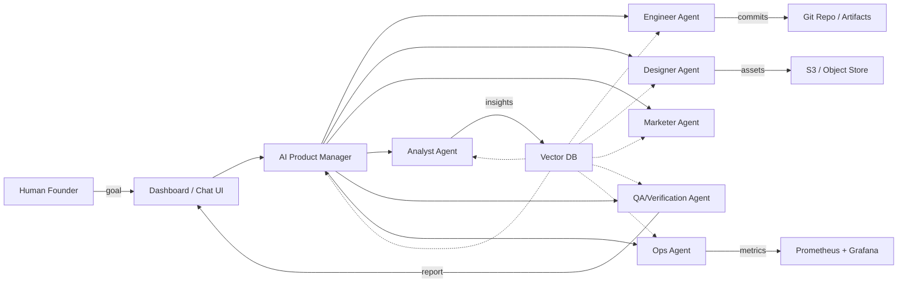

# AI Company — Product Manager + Multi-Agent Employees

> **Company-in-a-box:** an extensible system where an **AI Product Manager** orchestrates multiple **AI employees/agents** (Engineers, Designers, Marketers, Analysts, QA, Ops) to build, iterate, and ship products autonomously while keeping a human-in-the-loop for safety and approvals.

---

## Table of Contents

1. [Project Overview](#project-overview)
2. [Vision & Goals](#vision--goals)
3. [Key Features](#key-features)
4. [High-level Architecture](#high-level-architecture)
5. [Component Descriptions](#component-descriptions)
6. [Project Structure (file tree)](#project-structure-file-tree)
7. [Tech Stack & Rationale](#tech-stack--rationale)
8. [Developer Quick Start (local dev)](#developer-quick-start-local-dev)
9. [Workflow & Example Run (E2E)](#workflow--example-run-e2e)
10. [Agent Prompt Templates (copy-ready)](#agent-prompt-templates-copy-ready)
11. [Memory, Data & Tooling](#memory-data--tooling)
12. [Testing, Verification & Safety](#testing-verification--safety)
13. [Metrics, Monitoring & Cost Controls](#metrics-monitoring--cost-controls)
14. [Roadmap, Milestones & Deliverables](#roadmap-milestones--deliverables)
15. [Research Summary & References](#research-summary--references)
16. [Contributing & License](#contributing--license)

---

## Project Overview

This repository is the blueprint for a production-capable **AI-powered company** where AI agents collaborate to produce real-world deliverables. The system should support:

* Goal intake from a human (CEO / Founder).
* An AI Product Manager (PM) that decomposes goals into prioritized tasks with acceptance criteria.
* Multiple role-based agents (Engineer, Designer, Marketer, Analyst, QA, Ops) that execute tasks using tools and memory.
* Shared memory (vector DB) and a knowledge base for continuity.
* Verification, logging, and human approvals for public-facing results.

The primary intent is research + a practical MVP that can be iterated into a robust platform.

---

## Vision & Goals

**Vision:** Build a modular platform that can run small-to-medium product projects autonomously — from idea to prototype, with humans acting as final approvers.

**Goals:**

* Produce repeatable, auditable workflows where AI agents complete meaningful engineering & design tasks.
* Provide a safe sandboxed execution for code/artifacts.
* Minimize hallucinations via verification & retrieval-augmented generation.
* Provide observability and cost-control for token/API usage.

Success is measured by reproducible deliverables, human approval rates, cost per deliverable, and task throughput.

---

## Key Features

* **AI Product Manager**: central orchestrator for task decomposition & assignment.
* **Role-based Agents**: modular microservices for different roles.
* **Vector Memory**: persistent RAG memory (Chroma/Pinecone/Weaviate) to store context, decisions, and artifacts.
* **Sandboxed Execution**: Docker-based code runner or microVMs for safe code execution.
* **Verification Agent**: automated QA checks and hallucination detection.
* **Dashboard / Chat UI**: monitor agents, tasks, artifacts, and approvals.
* **Extensibility**: plugin marketplace for new tools (browsers, analytics, APIs).

---

## High-level Architecture


(Above mermaid is viewable on GitHub that supports mermaid. If the renderer doesn't render, the system includes ASCII alternatives.)

**ASCII diagram:**

```
Human -> Dashboard/UI -> AI Product Manager
                     /   |    \   
               Engineer Designer Marketer
                  |        |         |
              CodeRepo  DesignAssets  MarketingAssets
                  \        |         /
                   Verification Agent -> Memory / Logs
                             |
                          Monitoring
```

---

## Component Descriptions

### 1. Orchestrator / AI Product Manager

* Receives high-level goals.
* Decomposes into tasks with acceptance criteria.
* Assigns tasks to appropriate agents.
* Aggregates results and handles task retries/failures.

Implementation: microservice (FastAPI/Flask) that wraps an LLM + business logic (LangGraph/AutoGen-like orchestration patterns).

### 2. Agents (Engineers/Designers/Marketers/Analysts/Ops/QA)

Each agent is a service that has:

* Role-specific system prompt + behavior.
* Access to a subset of tools (code-runner, browser, design exporter).
* Short-term context + a retrieval interface to the vector DB.
* Rate limits and token budgets.

Agents should be easily pluggable (containerized) and communicate via the orchestrator or pub/sub.

### 3. Memory Layer

* Vector DB + metadata store for permanent knowledge.
* Stores decisions, important artifacts, specs, meeting notes, and verification logs.

### 4. Execution Sandbox

* Safe runner for code & scripts.
* Use Docker-in-Docker or lightweight microVMs (e.g., Firecracker) for isolation.
* Outputs are artifacts saved to Git or object storage.

### 5. Frontend (Dashboard)

* Real-time task/agent view, logs, artifacts, approval buttons.
* Chat-like interface for interactive commands.

### 6. Monitoring & Cost Controls

* Token usage tracking per agent.
* Alerts for cost spikes or agent failures.
* Logs and traces for auditing.

---

## Project Structure (file tree)

```
ai-company/
├─ README.md               # (this file)
├─ LICENSE
├─ .env.example
├─ docker-compose.yml      # spin up vectorDB, dashboard, orchestrator in dev
├─ infra/
│  ├─ k8s/                 # kubernetes manifests (optional)
│  └─ terraform/           # infra as code stubs (optional)
├─ orchestrator/
│  ├─ src/
│  │  ├─ main.py           # FastAPI app (orchestrator)
│  │  ├─ pm.py             # PM logic & prompts
│  │  └─ tasks.py          # task manager & scheduler
│  └─ Dockerfile
├─ agents/
│  ├─ engineer/
│  │  ├─ src/
│  │  └─ Dockerfile
│  ├─ designer/
│  ├─ marketer/
│  ├─ analyst/
│  ├─ qa/
│  └─ ops/
├─ dashboard/
│  ├─ web/                 # React/Next dashboard
│  └─ api/                 # web backend (optional)
├─ services/
│  ├─ vector_db/           # chroma/pinecone connector wrapper
│  ├─ git_service/         # commits & PRs automation
│  └─ sandbox_runner/      # docker runner for code execution
├─ docs/
│  ├─ architecture.md
│  └─ prompts.md
├─ examples/
│  ├─ resume-generator/    # sample project the agents can build
│  └─ landing-page/        # sample marketing + design flow
└─ tests/
   ├─ unit/
   └─ integration/
```

> Note: Keep agent code minimal initially — each agent should expose an API endpoint like `/run-task` accepting a task JSON, and respond with artifact metadata + status.

---

## Tech Stack & Rationale

* **LLM Provider:** OpenAI (GPT-family) or any provider that supports tool calling and fine-grained control.
* **Orchestrator Framework:** FastAPI (Python) + LangGraph or AutoGen for workflow orchestration. Python ecosystem is mature for LLM tooling.
* **Vector DB:** Chroma (dev), Pinecone / Weaviate (scale). RAG is essential to reduce hallucinations.
* **DB / Metadata:** Postgres for structured metadata and task state.
* **Storage:** S3-compatible (minio for dev) for artifacts.
* **Sandbox Execution:** Docker + isolated runner or Firecracker microVM for strict isolation of code execution.
* **Frontend:** React / Next.js for dashboard and interactive UI.
* **CI/CD:** GitHub Actions for automation + tests.
* **Monitoring:** Prometheus + Grafana for metrics; ELK stack for logs.
* **Secrets:** Vault / cloud secrets manager.

Rationale: the stack prioritizes modularity, open standards, and safety. Python has the richest tooling for LLM orchestration and retrieval libraries.

---

## Developer Quick Start (local dev)

This quick start assumes you have Docker & Docker Compose installed.

> **Prerequisites**

* Docker & Docker Compose
* Node.js (for dashboard) & npm/yarn
* Python 3.10+ and pip
* Git

**1. Clone the repo**

```bash
git clone https://github.com/<your-user>/ai-company.git
cd ai-company
cp .env.example .env
```

**2. Start dev services** (vector DB, local object store)

```bash
docker-compose up -d
# This should spin up Chroma or a dev substitute and minio (S3) and optionally a local Postgres
```

**3. Start orchestrator (dev)**

```bash
cd orchestrator
pip install -r requirements.txt
uvicorn src.main:app --reload --host 0.0.0.0 --port 8000
```

**4. Start an agent (engineer example)**

```bash
cd agents/engineer
pip install -r requirements.txt
uvicorn src.main:app --reload --port 8100
```

**5. Start dashboard (optional)**

```bash
cd dashboard/web
npm install
npm run dev
# open http://localhost:3000
```

**6. First demo run**

* Open Dashboard → enter a simple goal: `Build a one-page Resume Generator that accepts name, experience, and outputs a downloadable PDF.`
* Watch the PM decompose tasks and send to the `engineer` and `designer` agents.

**Notes:**

* Many service endpoints are stubbed for MVP. Initially the orchestrator may call agents manually (http requests). Later, replace with message queues (RabbitMQ/Redis Streams/Kafka).

---

## Workflow & Example Run (E2E)

**User goal → PM → Tasks → Agents → Artifacts → Verification → Human Approval**

1. **User** submits goal via Dashboard.
2. **PM** constructs a task list with acceptance criteria, stores it in Postgres, and pushes to queue.
3. **Engineer Agent** receives `build-api` task, scaffolds project, runs unit test in sandbox, commits to Git using the git service.
4. **Designer Agent** receives `create-ui` task, outputs HTML/CSS or Figma JSON to object storage.
5. **QA Agent** runs tests and content verification (RAG to detect hallucination in marketing copy).
6. **PM** aggregates and packages artifacts; if verification passes, PM requests human approval for public release.
7. **Human** approves or requests changes; PM assigns follow-ups.

**Sample task JSON** (from PM to Engineer)

```json
{
  "task_id": "t_001",
  "role": "engineer",
  "title": "Create backend for resume generator",
  "description": "Create a Flask API `/generate` that accepts JSON {name,exp} and returns a PDF.",
  "acceptance": [
     "API returns 200",
     "PDF contains name and experience",
     "Unit tests running in sandbox"
  ],
  "deadline": "2025-09-20T18:00:00+05:30",
  "token_budget": 2000
}
```

---

## Agent Prompt Templates (copy-ready)

Place these prompts in `docs/prompts.md`. Keep them versioned in memory for reproducibility.

### AI Product Manager (system prompt)

```
You are the AI Product Manager. Objective: convert the user's high-level goal into an actionable project plan.
- Produce a first draft plan with subtasks immediately (do not ask clarifying questions unless information is absolutely necessary).
- For each subtask include: description, role, expected artifact, tests/acceptance criteria, estimated effort (S/M/L), and priority.
- Assign to named agent services and give each a token budget & deadline.
- Persist the plan to the knowledge store and emit a task JSON for each subtask.
- If an assignment fails twice, escalate to Ops and notify the human.
```

### Engineer Agent (system prompt)

```
You are the AI Engineer. For each assigned task:
1. Produce a dev plan with file structure, dependencies, and commands.
2. Implement code in the repository (return a patch/diff or commit metadata).
3. Run unit tests in the sandbox. If tests fail, attempt fixes up to two retries, then escalate to PM.
4. Produce a short summary for the PM with a link to the artifact and test logs.
```

### Designer Agent (system prompt)

```
You are the AI Designer. For UI tasks:
1. Provide Figma JSON or a static HTML/CSS prototype with assets.
2. Ensure responsive layout and accessibility guidelines.
3. Export assets into the object store with clear metadata.
```

### QA / Verification Agent (system prompt)

```
You are the QA/Verification agent. For each artifact:
1. Run automated tests and sanity checks.
2. Cross-check any factual content against memory and web sources (RAG).
3. Report pass/fail with actionable bug tickets.
```

---

## Memory, Data & Tooling

* **Memory model:** store important artifacts & decisions in vector DB for retrieval.
* **RAG flows:** every agent uses a retrieval step to ground outputs in existing knowledge.
* **Tooling:** agents can be granted tool permissions (code runner, web-browsing via serp API, figma api) through a controlled plugin interface.
* **Artifact storage:** use Git for code, S3 for binaries and design assets.

Tips:

* Keep ephemeral vs persistent clear: ephemeral chat logs can be pruned; specs and final artifacts must be persisted.
* Version prompts with git to audit changes to agent behavior.

---

## Testing, Verification & Safety

**Testing approaches:**

* Unit tests for code artifacts (run in sandbox).
* Integration tests for multi-agent operations (simulate PM + Engineer + QA flows).
* Fuzz tests for APIs to catch edge cases.

**Safety measures:**

* Sandbox all code execution.
* Build a verification agent to run RAG cross-checks.
* Human-in-the-loop (HITL) gating: require approval for public-facing assets by default.
* Token/account caps per agent and per project to avoid runaway costs.

**Handling hallucinations:**

* Flag content that cannot be verified by memory or trusted sources.
* For such outputs: mark as `requires_human_review` and escalate.

---

## Metrics, Monitoring & Cost Controls

**Core KPIs:**

* Throughput: tasks completed / week
* Accuracy: % artifacts passing QA
* Time-to-complete: average hours per task
* Approval rate: % artifacts accepted without human edits
* Cost per deliverable: \$ per shipped item (API tokens + infra)

**Monitoring**

* Export token usage from LLM calls to Prometheus.
* Alert thresholds for spend spikes and agent error rates.

**Cost optimizations:**

* Cache common prompt responses.
* Use smaller/cheaper models for routine tasks and larger models for creative/critical tasks.
* Batch retrievals & chunk prompts to reduce repeated context.

---

## Roadmap, Milestones & Deliverables

**MVP (0–6 weeks)**

* Week 0: repo + planning
* Week 1: basic orchestrator + dashboard skeleton
* Week 2: PM + Engineer agent (manual calls)
* Week 3: vector DB + simple RAG
* Week 4–5: automation of end-to-end demo (Resume generator)
* Week 6: demo and evaluation

**Phase 2 (6–14 weeks)**

* Add Designer, Marketer, QA.
* Add automated verification & cost tracking.

**Phase 3 (14–26 weeks)**

* Plugin marketplace, personality profiles, multi-project support.
* Harden infra, CI/CD, multi-region deployment.

Deliverables for each milestone: demo video, artifact set, audit logs, and a short retrospective.

---

## Research Summary & References

This project builds on multi-agent orchestration patterns and RAG techniques. Key topics to study and why:

* **Multi-agent frameworks (LangGraph / AutoGen / MetaGPT / CrewAI)** — patterns for orchestrating agent workflows and messages.
* **Retrieval-augmented generation (RAG)** — required to reduce hallucinations and ground agent outputs.
* **Vector DBs: Chroma, Pinecone, Weaviate** — persistent memory layer choices.
* **Sandboxing tech: Docker, Firecracker** — safe execution of arbitrary code produced by agents.
* **Prompt engineering & prompt-versioning** — essential for reproducibility and safety.
* **Observability & cost management** — Prometheus, Grafana, token-level tracking.

Suggested reading list (search these keywords when researching):

* "LangGraph multi-agent"
* "AutoGen multi-agent framework"
* "MetaGPT software development agents"
* "retrieval augmented generation best practices"
* "Chroma vs Pinecone vs Weaviate"
* "container sandboxing for untrusted code Firecracker"

---

## Contributing

1. Fork the repo
2. Create a feature branch `feature/<name>`
3. Add small, testable commits
4. Open a PR describing the change, link an issue

Guidelines:

* Keep prompts in `docs/prompts.md` versioned and small.
* Tests must run in CI (GitHub Actions) and sandbox.

---

## License

This project is released under the MIT License. See `LICENSE`.

---

## Contact

Created for: **Your AI Company project**
Author: Aryan Thakare

---
